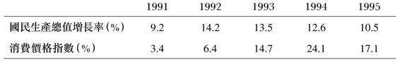

# 第23章 邓小平时代的终曲------南巡 1992

一代人之前的1965年，毛泽东对自己不能全面控制北京的"资产阶级"政策而感到不悦。他无法在中央党报《人民日报》上传播自己的观点，便在上海的《文汇报》上发表了一篇文章〈评新编历史剧《海瑞罢官》〉，次日该文又由上海市党报《解放日报》转载。然后，71岁的毛泽东乘专列去了南方的杭州、韶山和武汉等几个城市，为1966年发动的文化大革命点火。

这个故事在1991年又重演了一次。当时邓小平对北京保守的经济政策也感到不快，可是他对这些政策又不能完全说了算。他无法在《人民日报》上表达自己的观点，便把它登在另一家报纸------上海的《解放日报》上。可是1991年这把火并没有点着，决心已定的邓小平在1992年又点了一把更大的火。他以87岁高龄，乘专列南下，先去武汉，然后是深圳、珠海和上海，他在这些地方成功点燃了扩大市场开放和加快发展的大火。

1988年通货膨胀引起的恐慌，北京当局在1989年5月军事戒严失败后的几近崩溃，苏联和东欧政权相继垮台的新闻------这一系列事件使北京变得近乎绝望，气氛高度紧张。陈云仍是谨慎的计划官员的核心，邓小平则吸引着大胆主张扩大开放、加快发展的人。在1970年代末和1980年代初，建设派大多是从事引进新工厂和新技术的中央干部，到1980年代末时，沿海地方政府已积累起自己的财富，形成了更强大的势力基础，使邓小平能够用来对抗谨慎的计划官员。

陈云手下谨慎的计划官员认为，1988年的通货膨胀失控要对1989年的悲剧负责，因此他们更坚定地要把国家控制在他们认为唯一安全的轨道上。邓小平则认为，不加快国家的发展，共产党的统治就会陷入危境，因此他同样坚定地认为，只有加快发展和开放才能维持民众的拥护，使国家得以生存下去。对政权可能突然崩溃的担忧让双方关系更为紧张。[^1]

## 邓小平受挫：1990--1991

1990年1月21日至2月13日邓小平在上海度假期间，他已经在争取能使他压倒保守派经济政策的政治力量。他在上海与当地负责人讨论了开发浦东的大项目。[^2]他知道上海的负责人急于开发浦东，但这必须得到北京的许可。浦东是上海境内一片大约500平方公里的区域，靠近地理位置优越的长江入海口。当时这个地区大体上仍是农村，易于进行开发，甚至早在上世纪初，孙中山就曾萌生出在浦东建一个大港口的念头。上海当地官员希望将它建成金融中心。[^3]尽管上海一直受到中央政府的制约，但是在长江三角洲一带，不但上海，而且邻近的江苏和浙江，工业已经有了实质性的增长。

邓小平对如何加快经济发展有着战略上的考虑。他知道，鉴于上海的巨大规模和人才储备，它的任何进步都将对全国的发展产生直接的积极影响，不但能够惠及邻近的江浙两省，而且还有长江流域的数亿人口。[^4]1920年代邓小平赴法途中，曾在上海停留一周，第一次体验了这个城市的活力；十年后他又在上海做了几个月的地下工作；1949年他曾短暂地参与中共对上海的接管；1980年代末，当他为冬季"休假"来到这座城市时，能够感受到生气勃勃的上海人有待释放的能量。即使不像邓小平那样头脑敏锐的干部也十分清楚，上海的领导人对1930年代上海作为商业大都会的优越地位怀有自豪感，而当时的香港不过是个无足轻重的小城市；1980年代中央为广东和福建率先进行试验开了绿灯，却没有让上海这样做，这使他们十分不快。上海的负责人并不讳言：上海有着比广东和福建的任何城市更高的教育、科技和工业水平。上海的领导人得到了群众的全力支持，是邓小平加快发展经济的强大同盟。

1984年，作为开放的14个沿海城市之一，上海也获得了一定的发展空间，但是从1984年到1990年，上海没有得到北京多少帮助，它的潜力几乎没有发挥出来。广东较易于得到外企投资，在不发达的地区建新厂成本虽然高，但尚可做到。然而，对上海巨大的旧工业进行改造，需要只有政府才能提供的资本来支持。上海肩负的为国家财政作贡献的担子如此之重，得到的支持却很少，这让上海的领导人感到不满，他们一直在要求北京改变政策。北京一些部委的领导也愿意向上海投资，因为他们已经开始担心正在失去对广东的控制，那里的财政收入主要来自外边而不是中央政府。假如北京为上海提供资本，国家的计划官员对上海的控制能力要比对广东大得多。

1988年和1989年邓小平在上海过冬时，曾经与江泽民和接替江担任上海市委书记的朱镕基作过交谈。朱镕基在北京担任国家经委副主任时邓小平就认识他，把他视为一个难得的人才，他既有充满自信的领导能力，又有发展经济的战略眼光和难得的改革魄力。1990年2月，邓小平会见了朱镕基和上海其他党政军干部，与他们讨论如何为当地的发展点火。[^5]

2月回到北京后不久，邓小平对李鹏总理说："我已经退休了，但有一件事还是要给你讲一讲，你要更多地关心一下上海浦东的发展。"[^6]两周后的3月3日，邓小平把江泽民、杨尚昆和李鹏叫来，向他们宣讲国际形势和国内经济："人民现在为什么拥护我们？就是这十年有发展。⋯⋯假设我们有五年不发展，或者是低速度发展，例如百分之四、百分之五，甚至百分之二、百分之三，会发生什么影响？这不只是经济问题，实际上是个政治问题。"他然后又说："要用宏观战略的眼光分析问题，拿出具体措施。⋯⋯要研究一下哪些地方条件更好，可以更广大地开源。比如抓上海，就是一个大措施。上海是我们的王牌。"[^7]

遗憾的是，1990年，北京的领导人对邓导师上的课和上海的领导人加速经济发展的愿望无动于衷。他们当时更多地是跟着谨慎的计划派大师陈云走。陈云在上海郊区的青浦长大，经常回上海视察当地情况；在党内，他在跟上海有关的问题上享有特殊的权威。陈云反对在上海建经济特区，不仅因为这有可能给国家既有的重工业和税收基础造成风险，还因为作为一个在1920和1930年代在那里工作过的人，他深知资本主义的罪恶和上海商人那种在他看来对洋人过分卑躬屈膝的"买办习气"。因此，陈云担心外国租界死灰复燃。可是邓小平对陈云的迟疑已经失去了耐心。虽然没有点名批评陈云，但他在1990年2月说，上海的发展落后于广东。圈里人都知道，他这是在表达对陈云反对开放上海的不满。[^8]

定于1990年12月25日至30日召开的七中全会将要研究五年计划和十年规划的草案。在会议前夕的12月24日，邓小平又把江泽民、杨尚昆和李鹏叫来，再次给他们上课，讲明加快发展的道理。他强调在2000年以前让经济翻番的重要性，鼓励他的接班人不要害怕担风险。[^9]邓小平重申，如果中国的经济增长不够快，经济停滞就会变成政治问题，而紧缩政策加上外国制裁的负作用，正在放慢经济增长的速度。邓小平认为，只有放弃保守的经济政策才能避免重蹈苏联和东欧的覆辙。[^10]但是邓小平的课依然没有起多大作用。尽管他多次请求，七中全会仍然受到谨慎的保守派主导，他们更加担心的不是增长速度放慢，而是经济过热。

邓小平于1991年1月28日乘专列去了上海，在那里一直住到2月20日。他既是为了冬季休养，也是想再次为经济增长点火。听过朱镕基的汇报后，他视察了航空和汽车工厂，还有将要成为世界第三大悬索桥的南浦大桥的建设工地。[^11]邓小平重申他在1990年说过的话：1979年开放四个经济特区时没有开放上海，是他犯的一个错误，他原本应该利用上海的人才优势。他强调开发浦东不但对上海市，而且对整个长江流域都很重要。他说，金融------他有意避免使用容易引发不满情绪的"资本"一词------是现代经济的核心，中国想在金融领域获得国际地位，全国都得靠上海。[^12]

邓小平在1991年并未能使他的星星之火变成燎原之势。除夕时他和杨尚昆、李先念一起给上海负责人拜年的画面上了全国的电视，但并没有提到他要加快上海发展的努力。邓小平的意见甚至没有出现在《人民日报》上。不过，他在1991年也取得了两个小小的收获：他争取到足够的支持，把朱镕基调到北京担任副总理； 他还让上海的报纸发表了几篇文章，尽管用的是化名。1991年3月和4月，上海的干部让《解放日报》根据邓小平不久前在上海的讲话，整理出了四篇系列文章。[^13]这些文章没有暴露与邓小平的关系，而是署名"皇甫平"（意思是"黄浦评论"，又可指"辅助邓小平"）。[^14]第一篇皇甫平的文章发表于3月3日，批评了"一些同志"把市场说成资本主义。文章说，计划和市场只是利用资源的两种不同方式，不是社会主义或资本主义的标签。政治圈里的人在猜测"皇甫平"的文章背后究竟为何人，但当时只有极少数人知道那是邓小平。

中宣部动员《人民日报》和《光明日报》对"皇甫平"的文章进行了反驳。1991年11月，在雄伟的上海南浦大桥的通车仪式上，替北京的保守派领导人说话的李鹏总理公开批评了皇甫平的文章，他说，这些文章让人错误地以为北京的政治气氛发生了变化。[^15]

1991年，党的干部开始筹备将于次年年底召开的中共十四大。邓小平明确表示，假如江泽民致力于加快发展和扩大开放，他会支持他，不然他就要支持党的其他领导人。但是其他领导人也都受制于当时的主流气氛。例如，朱镕基到北京担任副总理后，仍在忠实执行元老们保守政策的李鹏总理感到了来自邓小平的压力------这是要用朱镕基取代他领导经济。但李鹏顶住了压力，朱镕基在1991年别无选择，只能执行当时的谨慎政策。

陈云和邓小平都避免公开斗争，但他们各自的拥护者却在公开替他们说话。1991年10月，国家主席杨尚昆借纪念辛亥革命80周年之机，支持更加大胆地实行改革开放。[^16]为另一方说话的邓力群则在1991年10月23日的《人民日报》上撰文警告说，阶级斗争很尖锐，存在着"和平演变"------即用资本主义逐渐取代社会主义------的危险，这正是自由派梦寐以求的事情。[^17]1991年底，当干部们为即将召开的党代会作准备时，战线变得明朗起来。保守派在11月25日至29日的八中全会上仍占上风，于是邓小平拿出了他的惯用手段：不把时间浪费在争论上，他要采取行动争取支持。

## 邓小平南巡：1992年1--2月

当邓小平的专列于1992年1月17日驶离北京站时，北京的其他中央领导并没有收到通知，甚至连江泽民也不例外。这次出行完全由武警部队一手操办。北京的其他领导人和南方负责接待他的干部只知道，邓小平夫妻、他们的四个子女（只有小儿子邓质方没有随行）及其配偶和孩子，一行17人，要出门散心观光，进行"家庭度假"。谁能反对这个老领导的家庭去度假呢？

邓小平南行的第一站是武汉，这里是华中地区的铁路枢纽，也是1911年辛亥革命爆发的地点。邓小平于1月18日上午抵达武昌火车站。尽管只是家庭度假之旅，但对待邓小平这样显赫的人物，湖北省委书记关广富和省长郭树言还是前往站台迎接邓小平的到来。邓小平只在站台上停留了20分钟，时间虽短，却足以让他发一通脾气。邓小平说："电视一打开，尽是会议，会议多，文章太长，讲话也太长，而且内容重复⋯⋯你们要多做少说。⋯⋯周总理四届人大﹝1974年﹞的报告，毛主席指定我负责起草，要求不超过五千字，我完成了任务。⋯⋯现在文件多如牛毛。"他提到这样的情况：省委书记去农村考察一个星期回来，文件就堆成了山，让他头痛。[^18]邓小平一向反对空话、长篇报告和不作认真准备的会议，他曾说过："没有话把嘴巴一闭⋯⋯会议和讲话是为了解决问题的。"[^19]发了一通脾气后，邓小平说出了他的要点："谁反对改革，就让谁下台。"尽管他是在向武汉当地的人说话，他的话也没有登在公开的媒体上，但很快就引起了江泽民的注意。两天以后江泽民对手下的干部说，要加快开放步伐，恢复对外开放政策，减少会议的数量。[^20]

列车于当天下午抵达长沙火车站，邓小平花十分钟时间接见了湖南省委第一书记熊清泉等省级干部。邓小平听到1991年尽管有自然灾害，湖南还是取得了大丰收后十分高兴。但邓导师还是给他们上了一课：他指示熊清泉说，湖南"搞改革开放的胆子要更大一些⋯⋯要加快经济发展"。[^21]

1月19日星期一上午，邓小平在广州短暂停留后，与陪同他的省级领导一起，开始了对最有活力的特区------深圳和珠海------为期11天的视察。当地干部一周前才接到通知为邓小平的到来作准备，他们跑到邓小平要去的所有地方佈置保安，安排包括痰盂在内的必要设施。他们只接到通知要为接待邓小平一家人前来度假作准备，但是当邓小平到达深圳时，他们已经收到在武汉和长沙与邓小平见过面的干部的详细报告，他们意识到，这并非一次寻常的家庭度假。[^22]

广东省委书记谢非、省委副秘书长陈开枝和其他几位省里的干部与一些当地干部一起在深圳为邓小平做向导。在迎接邓小平的干部中，有些人在1984年就接待过邓小平，他那次来时肯定了经济特区的成就。邓小平到达下榻的宾馆后休息了十分钟，然后与谢非等人在宾馆的花园里散步。邓小平的女儿邓楠提醒父亲说，八年前他在这里题过词。邓小平随口便背诵出了他当年的题字："深圳的发展和经验证明，我们创建经济特区的政策是正确的。"这引来高兴的东道主一片喝彩，他们把邓视为最强大的助推器，不同于那些试图限制他们投资的北京官员。

邓小平为了保持体力，只在每天上午游览三小时，然后与家人一起吃饭，午睡，下午休息。在当地一次外出游览时，家人在一块标识上看到用邓小平笔迹复制的 "深圳"二字，女儿邓楠说："你应该收利息，你有知识产权啊。"[^23]邓小平笑了。后来他们在仙湖植物园看到从成都运来的竹子，邓小平对当地导游开玩笑说，你们也要给四川支付知识产权费啊。[^24]邓小平这个玩笑是深有寓意的：人们都知道邓小平对西方要求中国支付大笔知识产权费的批评，邓小平提醒西方人说，其他国家模仿中国的火药和印刷术一类的发明，中国并没有为此收过费。但是邓小平也明白中国需要适应新的国际秩序。在视察深圳一家生产CD光碟的工厂时，他问他们是否从外国买了版权，并提醒工厂经理说："一定要遵守有关知识产权的国际规则。"[^25]

在广东，邓小平到处都被喜欢和感激他的人团团包围。在1982年和1983年，他虽然最初没有为特区辩护，但是当1984年特区受到北京保守派的严厉批评时，他却表扬了特区。广东人有一个说法：遇到绿灯往前走，看到黄灯抓紧走，碰上红灯绕着走。然而在1992年，广东人仍然担心来自北京的黄灯和红灯，渴望看到绿灯。邓小平正在支持他们的事业，支持扩大对外开放和加快经济发展，反过来，他们成了邓南巡计划的啦啦队。

按照北京为"家庭度假"制订的官方原则，邓小平只带了一名记者和一名摄影记者，也没有举行记者招待会。但是当他开始视察深圳时，估计有50到60名摄影记者紧紧尾随着他的"家庭度假"，很多人甚至买了盒式录音机，以便能够捕捉邓小平的每一句话。[^26]

邓小平心情振奋地观看当时在中国还不多见的高楼大厦，认真细致地视察新技术，听当地干部汇报情况。当地干部告诉邓小平，1984年时深圳的人均收入只有600元，1992年时已经达到2,000元。邓小平不可能不为自己加快发展的梦想可能变为现实的前景而欢欣鼓舞。在为鼓励加快发展的南行途中，当邓小平看着那些高楼大厦时，他也是在享受自己用改革开放政策所播下的种子结出的硕果。

邓小平来访的消息不胫而走，每当他从工厂和办公楼走出来时，都有大批普通市民在等着他。他在53层的深圳世贸中心旋转餐厅俯瞰了这座城市的新建筑，当他走出大楼时，有大批群众向他鼓掌欢呼。[^27]虽然邓小平有不善言谈的名声，但在女儿邓楠的帮助下------她不断凑到耳边，把他因耳聋听不清楚的话大声告诉他------他完全融入了与当地干部和充满感激的群众的交谈之中。在北京的许多干部眼中，邓小平是个严厉的司令员，深圳的群众却亲切地向他呼喊"叔叔好"、"爷爷好"，在他们看来，他热情机智，平易近人，对所有新事物有着浓厚的兴趣。

但是，在乘车时的私下场合，他愤怒批评了北京的保守派。他要求随行的当地干部------他们都支持他的想法------不要公开他的私下谈话。不过即使在公开场合，他也表明了自己的担心，他说，左的政策会造成可怕的后果，甚至会葬送社会主义。[^28]他警告说："要警惕右，但主要是防止'左'。"[^29]在与地方干部的坦率交谈中，针对那些把特区说成搞资本主义、受到外国人控制的批评者，他说，只有四分之一的投资来自外国人。他又说，中国在政治上控制着所有外国公司，可以确保它们对中国有益。他不仅不担心现在的外资水平，还主张增加外资数量，创建更多的合资企业：外国企业不但交税，还能为工人提供就业岗位和工资。[^30]

与在北京参加党内会议的邓小平相比，已经退休的邓伯伯和当地干部的交谈要随意得多。邓小平心情放松，不拘一格，风趣的言谈常引起当地领导的共鸣。邓小平上了他的最后一堂课：他敦促干部们大胆工作，努力试验。他重复了他在各地说过的话：坚持改革开放，保持一个精干的政府，培养年轻人，少说多做。参观了世贸中心大厦后，邓小平在返回宾馆的大巴上再次谈到他的很多基本观点：计划不等于社会主义，市场也不等于资本主义。资本主义也有计划，社会主义也有市场。贫穷不是社会主义。要走共同富裕的社会主义道路。为了达到这个目标，先富起来的地方要多缴税，用来帮助落后地区。但各地的情况不可能很快拉平，不能搞"大锅饭"，这会打击人们的热情。邓小平鼓励干部进行试验，敢于冒险，不要怕犯错误，有错改了就好。[^31]

邓小平鼓励深圳在20年内赶上香港、新加坡、南韩和台湾这亚洲四小龙。他说："新加坡的社会秩序算是好的。他们管得严。我们应该借鉴他们的经验，而且比他们管得更好。"听过有关深圳的贪污受贿和腐败问题的汇报后，邓小平说："你们要坚持两手抓，一手抓改革开放，一手抓打击各种犯罪活动，两手都要硬。"[^32]

在深圳度过五天后，1月23日深圳市委书记李灏向邓小平介绍了他对司法体制加以改造、规范和扩充的计划。邓小平仿佛仍在担任国家领导人一样，表示完全同意这些想法，并鼓励李灏大胆落实。北京的很多干部批评深圳走得太快，但邓小平送给李灏的离别语是："你们要搞快一点。"李灏回答说："我们一定会加快步伐。"[^33]邓小平的下一站是珠海，该市市委第一书记梁广大来到深圳，陪同邓小平一家人和省里的官员，乘船一小时跨过宽阔的珠江三角洲，来到了珠海。当船经过清代海关旧址时，邓小平再次提到他的离别叮嘱的要点：中国过去受到外国帝国主义的欺负，但那时代已经过去了，"落后就要挨打啊。我们已经穷了上千年，不能再穷下去了，如果不重视科学技术和教育，还要挨打"。[^34]

广东省委书记谢非和梁广大十分清楚，邓小平也担心日益加剧的经济不平等现象；他们知道他一直在鼓励先富帮后富。他们在船上告诉邓小平，一派繁荣气象的珠江三角洲地区正在大力帮助广东北部和西部的贫困山区。邓小平回答说，改革开放以来取得的进步，靠的是各地愿意搞试验的人的创造性，靠的是政府将行之有效的做法进行宣传、把各种新思想推广到全国其他地区的能力。[^35]

澳门比香港小得多，也不像香港那样喧闹。与此相似，毗邻澳门的珠海比深圳小，也不像深圳那样繁忙。在珠海29层贸易中心的顶层旋转餐厅，邓小平和家人眺望了建设中的高楼大厦。就像在深圳一样，邓小平与群众热情相处。在珠海的一家工厂，有人估计他和上百人握了手；在大街上，保护他的警察不得不限制他走进人群和更多的人握手。

邓小平在询问当地居民时，想搞清楚沿海城市的经济发展能以多快的速度向偏远地区扩展，推测未来的发展对群众意味着什么。他已经能够看到很多迹象，各种消费品------自行车、洗衣机、收音机、手表等工业制品------正在走进农民家庭。[^36]他高兴地听到穷困地区的农民工在沿海地区找到了就业机会。海外留学青年回来报效祖国的报告也让他大受鼓舞。他得知富有创业精神的中国人所领导的工厂已经接近世界技术水平。他表扬了当地领导利用市场推动社会主义事业所取得的成就，而从中受益的社会主义制度又能使市场更加成功。他说，从集中人力抓紧办事这方面说，资本主义赶不上社会主义。他还指出，如果没有从1984年到1988年取得的进步，1989年到1992年这个困难时期的事情就不会那么顺利。

从珠海驱车前往广州的途中，邓小平在珠海以北的两个县------中山和顺德------停留了片刻，经济特区的活力向邻近地区的快速扩散也使这两个地方蒸蒸日上。在广州与省领导层交谈了一个小时后，邓小平登上列车前往上海，途中在江西东部的鹰潭作了短暂停留。[^37]

到达鹰潭时，邓小平也在车站会见了当地干部，他们向邓小平汇报了去年的大丰收和抗击洪灾取得的成绩。邓小平对他们的工作给予表扬，但也对他们说，要多种树，这能防止造成洪灾的水土流失。邓小平还说，干部要走得更快一点，放开胆子进一步开放。邓楠这时插嘴说，父亲一路上老是在重复这些话；她又说，父亲很关心江西，六十年前他就在江西苏区工作过，文革中又在江西生活了三年半。事实上，邓小平一路上讲了不少自己1931年在瑞金和会昌的往事。[^38]邓楠提醒父亲说，1973年2月19日，在经历了文革期间"下放"农村的岁月后，他们一家人就是从鹰潭踏上了返京的列车。[^39]如今他们从鹰潭乘坐列车前往上海，当他们抵沪时，邓小平在广东播下的扩大对外开放的种子已经开始结出果实了。

## 突破

邓小平在1990年和1991年未能让国家回到改革开放的快车道上，但是由于香港的媒体和珠海的一次会议，他在1992年取得了戏剧性的突破。

按照行程安排，邓小平没有举行记者招待会，但他在深圳的消息一传出，香港记者便蜂拥越过边境前来报道他的南行。1月22日，邓小平到达深圳三天后，香港的《明报》就爆出了他南行的消息和加快开放的意见。该报还说杨尚昆也在深圳陪同邓小平。敏感的香港读者立刻意识到，邓小平的南行并非寻常的家庭外出度假。

香港左派报纸的编辑仍记得很多同事因支持"六四"示威而被解雇，因此在报道邓小平的行程和讲话时忐忑不安，但他们仍然在1月23日同香港电视台一起报道了邓小平来到深圳的消息。由于中国的宣传部门无法在毗邻香港的大陆地区遮罩掉香港的电视信号，广东南部有数百万人在香港电视台上看到了邓小平在深圳的部分画面。

北京那些站在谨慎的计划官员一边的宣传干部面临着艰难的选择：尽管邓小平南行的消息已在华南各地传开，但他们可以继续装聋作哑；或者承认这次南行，但尽量弱化邓小平对那些在改革开放上立场更保守的人的抨击。同时，邓小平的支持者------那些希望允许他们加快发展的南方当地干部，则愿意冒险把邓小平的意见传播出去。

由于邓小平在深圳和珠海引起的关注，保守的媒体负责人很难对他的南行佯装不知，但他们还是努力这样做了。2月3日，北京的电视台播出了邓小平和杨尚昆与上海领导人参加春节团拜会的消息，但只字未提他的深圳和珠海之旅或推动改革的努力。同一天，英文版《中国日报》登出一幅杨尚昆和邓小平在深圳拍摄的照片，但并未注明照片日期。2月4日，上海市委下属的《解放日报》的编辑很聪明，他们没有提邓小平南行，但在头版登出一篇文章赞扬邓小平解放思想的努力，这是得到三中全会批准的，也可以视为给上海要上马的大项目助力。[^40]不过，当时广东和上海的当地媒体都极想传播邓小平南行的消息，加之邓小平南行在华南已是家喻户晓，北京的宣传部门也无法阻挡外界知晓邓小平南行的目的。

在珠海，邓小平召开了一个表面上与军事规划------在江泽民领导下，这项工作又热了起来------有关的会议。邓小平把他在武汉说过的话又重复了一次："谁不改革，谁就下台⋯⋯我们的领导看上去像是在做事，但他们没做任何有用的事。"[^41]邓小平在珠海出席的这次有关"军事规划"的会议是由六名中央政治局常委之一乔石主持的。由于乔石分管国内治安，开这样的会也顺理成章，但乔石也被很多人认为具备担任最高领导人的素质，是江泽民的潜在竞争者，所以这次会议也可能和中国的领导层的人事安排有关。对江泽民来说更加意味深长的是，出席会议的还有国家主席兼军委副主席杨尚昆和另一名军委副主席刘华清将军。到会还有杨尚昆的弟弟、解放总政治部主任兼中央军委秘书长杨白冰。这些干部都与安全问题有关，但他们对加快改革的必要性的认识也与邓小平意见一致。[^42]

中国出版的有关邓小平南巡的书中没有提到珠海会议，官方的《邓小平年谱》中也没有相关纪录。这种省略不难理解，中共领导人不想向群众透露党内矛盾。但是，会议的与会者和珠海的观察者所透露出的消息，从江泽民在会后几周内的反应中得到了证实。出席会议的军队领导人的强大阵容表明，如有必要，军队高层愿意拥护一个新的领导人。

## 江泽民的反应

亟欲得知珠海会议确切内容的江泽民，说服福建省委第一书记贾庆林给了他一份会议录音；此后不久官方就宣佈贾庆林入选政治局。江泽民并没有在春节给邓小平打电话的习惯，但是在2月3日，即邓小平离开珠海五天后，江泽民打电话给邓小平拜年。他后来承认，这次通话并非随意而为。[^43]此后江泽民便成了更大胆的改革派。

邓小平于1月31日到达上海，在那里休息了三周。与在特区时相比，他迈着更加从容的步伐视察了浦东的开发，审阅了他在深圳和珠海讲话的文稿。[^44]他还游览了刚完工的浦东大桥以及杨浦大桥的建设工地。[^45]他再次作了"自我批评"，说过去没有把上海建成特区是一个错误，但是他提出，上海现在起步可以利用它作为后来者的优势，从广东的经验中学习，能够把事情办得更好。

同时，由曾做过华国锋和胡耀邦秘书的郑必坚牵头的一个写作班子，写出一个对邓小平在深圳和珠海的讲话作了系统总结的稿子。他们先是拿到了广东干部准备的一份两到三万字的邓小平南行讲话纪要，和邓小平一起作了数次修改后，把它浓缩为一个七千字的报告。与邓小平在行程中的生动讲话相比，这个报告看上去官方色彩更浓一些，它在邓小平离开上海前完成。[^46]

邓小平在上海停留期间，陈云也住在上海，但邓小平没有安排与他见面。不过杨尚昆主席和上海市委书记吴邦国亲自去给陈云拜了年。[^47]像陈云这样老练的领导人自不难理解邓小平这些精心谋划的动作在政治上的微妙之处，也不难了解邓小平加快改革的努力所得到的军界的强力支持，以及浦东开发计划所得到的上海市委的热烈拥护。

邓小平十年来一直忙于工作，从未逛过商店，但是他有一天上午去了当时中国最大的零售商店------上海第一百货公司。他在这里可以看到琳琅满目的消费品，这与14年前改革刚开始时消费者在货架上看到的可怜的供应状况形成了鲜明对比，这只会使他对中国的进步感到更加自豪。[^48]在女儿邓榕的帮助下，他给孙子们买了几枝笔，作为送给他们的礼物。

当邓小平踏上回京的列车时，他有理由期待自己的南行达到了目的，现在江泽民要加快发展与改革了。[^49]确实，从2月20日邓小平离沪回京到3月6日，《深圳特区报》的人对邓小平会取得最后的胜利相当乐观，大胆发表了八篇详细报道邓小平南行的系列文章。[^50]虽然北京宣传部门的领导试图阻止这些文章进入北京，但最终仍无法避免它们被全国的读者看到，当然也包括首都北京的人。

2月中旬，邓小平回京前几天，江泽民已经在公开说，他拥护邓小平进一步改革的呼吁。[^51]江泽民通过从珠海得到的报告认识到，邓小平已经下定决心，假如他不大胆推进改革开放，邓小平就会让他靠边站。江泽民从邓小平的南行中，能够看到他争取到了北京和地方重要领导人的很多支持。后来江泽民也承认，当时他断定邓小平的观点会占上风，他的明智之举就是支持这些观点。[^52]

郑必坚整理出的邓小平特区讲话概要完成后，江泽民经政治局批准，把稿子发给了人数有限的最高层干部。与邓小平的即兴讲话相比，整理后的讲话稿已不那么咄咄逼人，但依然有力，直截了当。当党内领导层开始意识到邓小平南行所受到的关注并读过报告后，他们认识到邓小平尽管已经年迈，但他在发动一场决定性的战役，他的拥护者正在迅速增加。[^53]上海、广东等地的领导人希望加快市场开放，对其结果更加乐观，所以都站在了邓小平一边。即使没有邓小平的南行，外国制裁的逐渐取消和保守派在降低通胀压力上取得的成功，也会使中国的领导层提高发展目标。但是邓小平的南行及其成功地让江泽民转变立场，使变化来得更早，并以更快的步伐持续下去。

尽管江泽民开始转向邓小平的观点，全国性的媒体仍迟迟没有宣传邓小平的南行和讲话内容。2月20日，邓小平回京的前一天，保守派的双月刊《当代思潮》为维护计划官员的谨慎观点作出了最后抵抗，发表了邓力群的一篇无疑是反映陈云观点的文章。该文称，主要危险不是来自左，而是来自右。"信奉自由主义执迷不悟的人，正是打着反'左'的幌子，反对党的领导和社会主义制度。⋯⋯如不加以反击，结果必然是各种反共思想的大氾漤。"[^54]

然而潮流已变。文章登出来之后，保守派的声音日渐衰落，因为江泽民及其同事开始让民众作好准备，他们要回应邓小平加快发展的呼吁。2月21日，即邓小平回京当天，《人民日报》刊发了根据郑必坚整理的讲话稿撰写的社论，题为〈更大胆地进行改革〉。[^55]社论仍然未提及已被香港媒体大肆报道了一个月的邓小平南行。但是一周后的2月28日，北京领导人下发了根据邓小平一周前的讲话写成的中央2号文件，在更多的高层干部中传阅。就像大多数党的文件一样，它措辞慎重，四平八稳，失去了邓小平最初讲话的力量与活力。文件的标题是〈关于传达和学习邓小平同志重要讲话的通知〉。它只印发给了全体中央委员和个别团体，例如中央党校的2,000名学员和教师。[^56]

在3月9日至10日的政治局会议上，全部15名政治局委员讨论2号文件时，形成了一致支持文件的意见。邓小平以地方干部的支持作为后盾奋力前行，他利用了香港媒体并动员军队的支持。但是他也利用了经济领域传来的喜讯。不但通胀在陈云的努力下得到控制，工业也开始增长，出口强劲，外国开始放松制裁。经济扩张的气氛已经大为改善。

在政治局会议上，杨尚昆主席首先发言大力支持文件，江泽民随后也表示完全拥护邓小平的意见，承认自己在推动改革上行动不力。[^57]政治局一致肯定了邓小平南行讲话中加快改革开放步伐的观点，同意把它作为将在年底召开的中共十四大的核心内容。邓小平后来也同意将2号文件作为三卷本的《邓小平文选》的最后一篇文章。熟悉邓小平言行的人，不会对他的意见的基本思想感到意外：更大胆地实行改革和对外开放。

3月的政治局会议之后，邓小平南行讲话的要点就成了官方政策的指导方针。3月11日，政治局会议后的第二天，也是邓小平开始南行两个月以后，新华社终于正式报道了邓小平南行的新闻，并在相关社论中提出要更大胆地实行改革开放。但是直到3月31日，《人民日报》才终于"归队"，刊登了邓小平视察深圳的详细报道。

## 气氛的变化

随着邓小平南行的消息得到全面报道以及政策开始发生变化，邓小平的讲话也成了著名的"南巡谈话"。"南巡"是帝制时代皇帝巡视南方（指长江流域，不像邓小平南下那么远）时使用的说法。为了消除邓小平像个皇帝的印象，官方的说法换成了更为中性的"南方谈话"。

保守派干部意识到了邓小平讲话得到的普遍拥护，勉强同意了反映邓小平讲话精神的文件。在3月20日全国人大的年度会议上，人大代表中间的政治气氛反映着邓小平南行带来的干劲。[^58]知识分子和军队干部利用已经变化的气氛，在各自单位向左倾思想发起了进攻。杨白冰在3月23日宣佈，军队要"为改革开放保驾护航"，这是在明确警告那些拖后腿的人。

5月底，党中央印发了旨在贯彻邓小平政策的4号文件。文件宣佈开放长江沿岸的5个内陆城市和9个边境城市，并宣佈30个省会城市一律享有和经济特区同样的特殊政策。[^59]

南行后的几个月里，邓小平并没有同江泽民见面，告诉他如何进一步推动改革开放，也没有明确表示支持江泽民。实际上，据江泽民说，他觉得邓小平仍在考验他，潜在威胁犹在：假如江泽民不全力支持改革，得到军队拥护的邓小平有可能用乔石把他换掉。

江泽民决心在邓小平的最后考试中过关。春季，在公开场合，他变成了进一步改革开放的大力鼓吹者。他仔细拟定了6月9日在中央党校省部级学员毕业班上的讲话。[^60]在这篇题为〈深刻领会和全面落实邓小平同志讲话的重要精神，把经济建设和改革开放搞得更快更好〉的讲话中，他全面说明了贯彻邓小平南巡讲话精神需要做些什么，总结了邓小平自1978年三中全会以来的贡献。江泽民说，要加快改革步伐，把增长目标提高到每年9%至10%（当时五年计划的官方目标仍是李鹏在全国人大会议上所说的6%）。江泽民说，要大胆学习资本主义国家的先进经验，没有必要讨论改革姓"资"还是姓"社"。江泽民进而把这些想法概括为一个他估计能得到邓小平赞成的说法："社会主义市场经济"。[^61]

6月12日，在作了这次重要讲话三天以后，江泽民这位后辈抱着希望去问师傅，是否同意"社会主义市场经济"的说法，显然它是被打算用来取代陈云的"有计划的社会主义市场经济"的。邓小平说他喜欢江泽民的讲话，这让江泽民如释重负；邓又说："其实深圳就是社会主义市场经济。"江泽民的考试过了关。随后，邓小平仿佛仍然是最后的决策者那样，他让江泽民把中央党校的讲话在内部传阅，如果反响好的话，可以作为十四大的主题。不出意外，反响果然不错。

陈云是谨慎保守的政坛元老，但也是一向拥护中央决策的严守纪律的党员，他接受了政治局关于加快改革开放的一致决定。1992年初他为过冬去上海住了数月，他看到浦东的进步，与负责开发浦东的上海干部进行了交谈。4月26日，陈云回京的前一天，听了上海市委书记吴邦国和市长黄菊的汇报，他不但赞成他们搞活上海的努力，而且让他们胆子更大一些。

大约三个月后的7月21日，陈云在纪念他的长期同事、一个月前去世的李先念的文章中写道：他和李先念从未去过特区，但是他们都认为这种试验是必要的，"我们要从特区的经验中学习，把它们办成功"。他说，他对深圳的现代建筑、它所取得的出口增长率远高于进口增长率的巨大成就印象深刻。他还说："中国的经济发展变得规模更大，比过去更复杂，很多过去有效的做法已经不能适应当前改革开放的形势。新的形势要求我们不断学习探索，解决新问题。"[^62]陈云一直在努力将通货膨胀降下来，使计划体制平稳运行。1992年，多亏他在1988年开始实行的紧缩政策，通胀得到了控制，出口克服了外国制裁的影响开始增长。陈云在他的毕生事业即将结束时，承认中国正在进入一个更加复杂的新时期。实际上他是给下一代领导人投了信任票，他们将带领中国走上另一条道路，这与他过去为之奋斗的道路大不相同。

到夏天时，邓小平已巩固了自己的胜利。地方干部获准提高投资比例，扩大对外贸易，沿海地区的试验也被推广到内地。邓小平可以把精力用于国家在今后几十年将面对的另一些问题了。7月24日，在看了为即将召开的十四大准备的文件草稿后，邓小平提出了几个有待思考的问题：农村体制、他本人在中国的发展中的作用、统治制度、国家安全。

关于农村政策，邓小平承认，包产到户和取消公社对于调动农民的积极性是必要的。但是由于新的农业技术的出现和发展，耕作小块土地的农户单靠自身财力无法提升技术，到一定时候仍然需要大的集体组织。邓小平建议领导人在这件事上不要操之过急，要等待农户主动要求改变体制。

在考虑自己的思想遗产时，邓小平说，领导人不能夸大本人的作用，要实事求是。推动改革开放是一个宏大而复杂的过程，没有哪一个或几个领导人能把所有的事情都想到。例如，谁也没有事先深入思考过依靠乡镇企业，它们却成了中国发展的重要因素。1978年以来中国取得的成功，是来自广大人民群众的经验。他本人的作用只是把这些发展作了总结，向更多的人推广。

关于统治和自由的问题，邓小平说，"民主集中制"仍是"最合理的制度"，要作为治国的基本原则加以坚持。领导人要想办法鼓励人们表达自己的观点，但是决定一旦作出，就应当服从集体决定。

邓小平还谈到中国的安全问题。他说，各国之间的势力制衡正在发生重大变化，仔细研究这些变化十分重要。在当前形势下，他认为中国可以继续缩小军队规模，但同样重要的是提高军队人员的素质，增强战斗力，准备好在必要时能够保卫国家。[^63]

邓小平审阅并批准了江泽民将在十四大上做的报告。报告的核心内容是他南行时表明的观点：加快改革开放。

## 中共十四大：1992年10月12--18日

中共十四大像以往一样，对有关当前和未来政策的文件作了认真讨论，但它首先是对邓小平及其成功政策的公开颂扬------实际上，是为他的退休召开的欢送会。大会的主要发言，即江泽民所做的政治报告，充满了对邓小平及其政策的赞扬，这一政策将成为中国未来五年的指导路线------建设"社会主义市场经济"。当然，江泽民的讲话也反映着与保守派的某种妥协。邓小平原来提出的年增长率是10%，江泽民的报告则建议把目标定为8%或9%，但这仍比李鹏早先提出的6%高出许多。[^64]

江泽民不但赞扬邓小平是中国改革开放的总设计师，而且把他的观点上升到"邓小平理论"的高度。知情人都清楚，邓小平是个实干家，不是意识形态宣传家；与共产党国家的很多领导人不同，他并不认为担任最高领导人必须成为理论家。但是对于江泽民来说，把邓小平的观点上升到理论高度，能够加强它的重要地位，使之可以与"毛泽东思想"平起平坐，让人们能够像干革命一样集中精力搞四化。

邓小平的功绩是，他提出了"有中国特色的社会主义"理论，采用了"社会主义初级阶段"的说法。邓小平"理论"正是按他所希望的样子完成的：它们为支持继续扩大市场的实用主义政策提供了意识形态的合法性。江泽民还重申了邓小平关于有些事情不要管它姓"社"姓"资"的观点。公有制仍然是主要的所有制形式，但要继续使国有企业变成更加独立的经济单位。要在试验的基础上引入股份制，不但要扩大商品市场，还要发展资本、技术、劳动力、信息和住房市场。科学技术不但是生产力，而且是第一生产力。[^65]总之，这次大会是对邓小平基本观点的明确肯定。毛泽东的基本信念------阶级斗争和不断革命------在他去世之前就已经式微，并且随着他的去世而消失。相反，邓小平的基本政策和人民的经济需求与愿望产生了共鸣，在后来的十几二十年里继续指导着政府的决策。

在天安门悲剧刚过去三年的这次大会上，江泽民像邓小平一样，更加强调稳定而不是政治改革。在十四大上，他没有再提赵紫阳在上次大会上提出的党政分开和党企分开。像邓小平一样，江泽民用严厉的措词谴责了1989年的"反革命暴乱"，但他仍然坚持主要威胁不是来自右，而是来自左。[^66]

虽然邓小平的精神主导着中共十四大，但直到大会结束时他才到场。邓小平进入会场时，走到江泽民身边站了大约20分钟，让电视摄录机拍下他们两人在一起的镜头。邓小平把衣钵传给江泽民，这条新闻传遍了全国，传向世界。[^67]江泽民已经表明要坚定地继续实行改革开放，邓小平现在表明他完全支持江泽民。从那一刻起，江泽民不再需要回头看邓小平是否同意；权杖已传到他的手里，邓小平等人现在把他称为党的第三代"领导核心"。[^68]

在中共十四大之前不久，邓小平迫使他的长期盟友、与他一起南行的杨尚昆和杨白冰兄弟退休。[^69]邓小平指定77岁的刘华清------他能听从江泽民的领导------和江泽民的亲信曾庆红取代了他们。[^70]江泽民长久以来一直觉得，比他资格老的杨氏兄弟是碍手碍脚的对手。邓小平早先曾对江泽民说："毛主席当家时是他说了算，我当家时是我说了算，如果你当家后也能说了算，我就放心了。"[^71]邓小平与杨尚昆和杨白冰关系密切，但是对于他来说，一个强大团结的国家领导班子要比私人友情更重要。他做了他所能做的一切，让江泽民获得能指挥一班人为国家提供有效领导所必需的全部权威。

毛泽东去世后，他选出的接班人不是被捕就是被排挤到一边，而邓小平退休前选出的接班人继续领导了国家二十多年。在1997年的中共十五大上，江泽民再次当选为新一届领导人，他干完了十年任期，外加赵紫阳留给他的两年。尽管邓小平在1992年春天之前有一些担忧，但江泽民在天安门悲剧后的艰难时期，面对世人的怀疑和外国制裁，成功维护了国家的团结并领导着国家。他坚定地执行着邓小平的改革开放政策，表现出杰出的政治才干。鉴于天安门悲剧和苏联东欧共产主义政权全面崩溃后的各种不确定因素，江泽民能成功地掌舵稳定前行，堪称一项了不起的成就。

1992年6月，被邓小平在1991年调到北京的可信的经济领导人朱镕基副总理，兼担任了新组建的经贸办公室主任，这个部门成了在监管经济工作方面权力最大的机构。[^72]后来，1993年3月的全国人大会议上宣佈了新的政府人事任命，李鹏再次当选总理，朱镕基成为第一副总理。李鹏在镇压"六四"示威中发挥过重要作用，所以只要有他担任总理，邓小平便不必担心为"六四"平反的问题。朱镕基在管理经济上成绩卓著，尤其是他既克服了通胀压力，又没有使经济像1988年至1989年那样硬着陆。朱镕基在1997年中共十五大上成为国务院总理。

邓小平在十四大选定的政治局常委中最年轻的成员是胡锦涛，他成为继江泽民之后的接班人。那次大会时他只有50岁，比其他成员的平均年龄小8岁。胡锦涛努力争取其他老领导对他的继续支持，后来经中共十六大和十七大通过，他作为第四代领导人核心担任了两届总书记。这样，邓小平选定的接班人在1992年之后就得到了三届党代表大会的认可。

正如邓小平计划的那样，中共十四大也标志着任期终身制的结束。为老一代革命家表达意见提供正式渠道------因此也缓解了他们从一线退下来后的心情------的中央顾问委员会被正式解散。不但邓小平，而且包括邓小平的对手陈云在内的老一代领导人，全都退出了政坛。此后，包括最高领导人在内的所有任命都有任期限制。1992年当选的另一些担任重要职务的干部，都是根据邓小平的人事政策------把在原来的岗位表现突出的人一步步提拔到更高的岗位------选出来的。

1992年当选的政治局委员，都是与邓小平的政策完全步调一致的人。进入政治局的两名政府部长------外交部长钱其琛和外贸部长李岚清------以外交事务和扩大对外开放作为本职工作。在1992年以前的政治局委员中，有一名代表内陆省份的成员，但他在1992年落选，新增的五名担任省级职务的政治局成员，都来自在邓小平开放政策下蓬勃发展的沿海省市：广东的谢非、北京的陈希同、上海的吴邦国、天津的谭绍文和山东的姜春云。仍然留在政治局的北京干部也都是来自沿海地区：乔石、杨白冰和刘华清，他们曾于邓小平南巡期间在珠海与他一起策划战略。这些资深领导人的年龄使他们不会忘记大跃进的失败。他们多数在1960年代早期就担任重要职务，在文革中受过冲击。1978年之后他们成了坚定的改革派，决心贡献他们的余生纠正错误的政策，推动中国的现代化。

与这些人相比，江泽民手下后来成为第四代领导人的都不是老革命，而是在邓小平那一代领导人创建的体制下成长起来的好学生。他们出生在战争年代，却是在1949年后共产党的领导下接受的教育。他们年龄太小，没有赶上去苏联或东欧学习的机会；又因年龄太大，错过了去西方留学的年代。他们上学时，西方的法学、经济学和商业管理这些学科还没有被引入中国，但他们在任职期间通过文件、会议和短训班的形式学习了这方面的知识。他们是既能干又眼界开阔的技术官僚，大多数人是学工程技术出身，接受现有体制并希望维持它的有效运转。作为一个群体，他们的优点是做事负责，与同事和下级都能搞好关系，不会挑战上级。他们没有经历过严重危机的考验，也不准备挑战现行体制。他们只是在邓小平那一代人创建的框架内，务实而勤奋地工作着。

## 南巡的成果

按照中共十四大和1993年3月全国人大会议把增长率定为8%或9%的政策，更多的地方投资和建设项目得到了批准。在邓小平1992年南巡后的几年里，中国取得了世界上史无前例的增长率，其规模也是前无古人的。实际上，从1992年到1999年，每年的经济增长率都超过了10%。

天安门悲剧后的1989年至1991年，外国直接对华投资陷入停滞，平均每年只有40亿美元；但是从1992年到1999年，由于中国的对外开放政策和外国制裁的逐渐减弱，每年吸引的外资平均为350亿美元。快速增长引发了又一轮经济过热和通胀压力，但朱镕基在1995年以软着陆方式控制住了这些压力。

允许一些指定的企业直接与外国公司做生意的决定，使对外贸易突飞勐进。在此之前，从事进出口的企业都要通过国营外贸公司进行交易，这使它们难以及时把握国外市场的机会。此外国营外贸企业也应付不了外贸的迅速扩张。不过，渐渐地，先是某些指定的企业被允许直接与外企做生意，然后这类企业的数量不断增加。在改革派实行新政策后，住房建设也开始腾飞。1995年以前，住房都是由工作单位或城市的干部分配，这一年之后政府放开了住房市场，国家雇员得以按补贴价买下自己的房子。由于私人房地产市场的创建和从建房中获利的机会的到来，新住宅的建设速度令人瞠目结舌。[^73]

邓小平的南巡并没有使谨慎的计划派和保守的意识形态宣传家闭口不言，但却使可以接受哪些目标和手段的争论再次转移了方向；不论有多么勉强，即使最警惕的计划派也开始逐渐接受让市场和外贸发挥更大作用。随着无数中国人从国内外市场中受益，改革开放成了不可逆转的政策，重新关上1978年后打开的大门已经不可能了。

## 记住邓小平

在20世纪后几十年的时间里，中国的不断革命断送了它的许多英雄。邓小平本人就经历过三起三落，但他在晚年要比任何一位同侪更幸运，他们中间的很多人结局凄惨甚至是悲剧。1976年"四五"示威之后，毛泽东在生前最后几个月所面对的现实是，北京的老百姓抛弃了他的文化大革命和阶级斗争，他们更喜欢周恩来的四个现代化。周恩来在去世前知道自己仍然受到毛泽东和他为之奉献了一生的党的批评。刘少奇在"文革"中受到批判，因得不到适当治疗在软禁中死去。胡耀邦被无情罢免后，最后两年受到与他共过事的领导人的冷落。赵紫阳在徒刑中去世，生前官方对他闭口不谈，只允许他接待寥寥几个经过选择的客人。华国锋靠边站后受到羞辱。叶帅愉快地退了休，在他所熟悉的家乡安享晚年，但他对北京的变化已不再感到很舒心。

邓小平知道，他对1989年天安门示威运动的处理方式，会被很多人认为是他一生中的巨大污点。无论国内国外，很多人认为他在1989年6月过分关心维护社会秩序、同意向街头的无辜百姓开枪是不可饶恕的行为。他们认为他有机会推动民主事业，却没有作出足够的努力。他没有解决腐败和不平等的这类根本问题。相反，为邓小平辩护的人则赞扬他敢于承担责任的勇气，他为维持国家的统一做了不得不做的事。

然而，不管对天安门悲剧的看法如何，很多人钦佩他以87岁高龄毅然踏上南行之路以确保中国在加快改革开放的道路上继续前行的步伐的举动。确实，在生前的最后几年里，邓小平看到了自己选定的接班人仍遵循着他所制订的政策，而这些政策推动着中国的进步。最后几年他与家人一起度过，并受到党和人民的爱戴。他引导中国完成了从落后、封闭、僵化的社会主义制度走向一个有国际影响的现代化经济强国的艰难过渡。假如中国人要感谢某一个领导人改善了他们的日常生活，这个人就是邓小平。在为改善如此之多的人民的生活作出的贡献方面，20世纪是否还有其他领袖能够与他相比？20世纪是否还有其他领袖对世界史产生了如此巨大而持久的影响？

邓小平曾说，他要让人们记住一个真实的他。他希望人们好好地记住他，但不想让人们像吹捧毛泽东那样为他大唱赞歌。毛主席自视为功高盖世的皇帝，邓小平则从不自视为"天子"。他只想让人们记住他是一个凡人，是"中国人民的儿子"。

邓小平最后一次公开露面是1994年春节。此后他的健康状况恶化，再也没有力气参加会议了。他于1997年2月19日午夜后去世，享年92岁，死因是帕金逊综合症和肺部感染。[^74]他要求自己的葬礼简单朴素。毛泽东的遗体经过处理后被安放在专门创建的毛主席纪念堂供人瞻仰。但不会有邓小平纪念堂。2月25日，大约一万名经过挑选的党员在人民大会堂参加了邓小平的追悼会。江泽民强忍着泪水念完悼词。[^75]追悼会通过电视做了转播，有关邓小平生平的报道在此后数天一直占据了媒体的主要位置。按照邓小平的遗愿，他的眼角膜被捐出供眼科研究，内脏被捐出供医学研究，遗体被火化，骨灰盒上覆盖着中国共产党党旗。1997年3月2日，他的骨灰被撒入大海。

[^1]:Joseph Fewsmith, China since Tiananmen: From Deng Xiaoping to Hu Jintao, 2nd ed. (New York: Cambridge University Press, 2008).

[^2]:中共中央文献研究室编：《邓小平年谱（1975--1997）》（上下册）（北京：中央文献出版社，2004），1990年1月20、26日，2月13日，页1307--1308。

[^3]:Victoria Wu, "The Pudong Development Zone and China's Economic Reforms," Planning Perspectives 13, no. 2 (April 1998): 133--165; 中央文献研究室科研部图书馆编：《邓小平人生纪实》（三卷本）（南京：凤凰出版社，2004），第三卷，页2019--2052。

[^4]:童怀平、李成关：《邓小平八次南巡纪实》（北京：解放军文艺出版社，2002），页214--216、220。另一纪录见中央文献研究室科研部图书馆编：《邓小平人生纪实》。

[^5]:《邓小平年谱（1975--1997）》，1990年1月26日，页1307。

[^6]:童怀平、李成关：《邓小平八次南巡纪实》，页216。

[^7]:SWDXP-3, pp. 342--343; 《邓小平年谱（1975--1997）》，1990年3月3日，页1309--1311。

[^8]:《邓小平年谱（1975--1997）》，1990年2月13日，页1308。

[^9]:SWDXP-3, December 24, 1990, pp. 350--352.

[^10]:Robert Lawrence Kuhn, The Man Who Changed China: The Life and Legacy of Jiang Zemin (New York: Crown, 2004), p. 205.

[^11]:童怀平、李成关：《邓小平八次南巡纪实》，页204-- 222；黄宏主编：《硬道理：南方谈话回眸》（济南：山东人民出版社，2002），页127--149。

[^12]:SWDXP-3, pp. 353--355.

[^13]:《邓小平年谱（1975--1997）》，1991年2月10、12、14日，页1327--1328。

[^14]:《邓小平年谱（1975--1997）》，1991年2月15日，3月2日，3月22日，4月12日〔年谱中1991年并无这四天的条目。------中文版编者注〕；黄宏编：《硬道理：南方谈话回眸》，页130--136。

[^15]:James A. R. Miles, The Legacy of Tiananmen: China in Disarray (Ann Arbor: University of Michigan Press, 1996), pp. 78--83; Suisheng Zhao, "Deng Xiaoping's Southern Tour: Elite Politics in Post-Tiananmen China," Asian Survey 33, no. 8 (August 1993): 748--749.

[^16]:Fewsmith, China since Tiananmen, p. 54.

[^17]:Fewsmith, China since Tiananmen, p. 232.

[^18]:童怀平、李成关：《邓小平八次南巡纪实》，页226。

[^19]:童怀平、李成关：《邓小平八次南巡纪实》，页226。这话说于1980年2月29日。

[^20]:童怀平、李成关：《邓小平八次南巡纪实》，页227--228。

[^21]:童怀平、李成关：《邓小平八次南巡纪实》，页228--229。

[^22]:2003年10月对陈开枝和另一些当地干部的采访，陈开枝曾陪同邓小平视察。

[^23]:童怀平、李成关：《邓小平八次南巡纪实》，页231--232。

[^24]:童怀平、李成关：《邓小平八次南巡纪实》，页243。

[^25]:Miles, The Legacy of Tiananmen, pp. 96--97.

[^26]:2003年10月对陈开枝的采访，邓小平南巡时他任广东省委副秘书长，负责安排邓小平在深圳和珠海的行程。另参见岑隆业编：《阅爱无价》（北京：作家出版社，2001），页182--190；关于摄影记者和录音机的记述见Zhao, "Deng Xiaoping's Southern Tour," p. 750. 记录这次视察的另一份文献见黄宏编：《硬道理：南方谈话回眸》，页150--190。

[^27]:童怀平、李成关：《邓小平八次南巡纪实》，页234--235。

[^28]:2003年11月在广州对一位与邓小平随行干部的采访。

[^29]:SWDXP-3, pp. 362--363.

[^30]:童怀平、李成关：《邓小平八次南巡纪实》，页232；Kuhn, The Man Who Changed China, p. 212.

[^31]:童怀平、李成关：《邓小平八次南巡纪实》，页240、245--246。

[^32]:童怀平、李成关：《邓小平八次南巡纪实》，页232--233。

[^33]:童怀平、李成关：《邓小平八次南巡纪实》，页246--248。

[^34]:岑隆业编：《阅爱无价》，页186。

[^35]:童怀平、李成关：《邓小平八次南巡纪实》，页248--249。

[^36]:童怀平、李成关：《邓小平八次南巡纪实》，页251--253。

[^37]:《邓小平年谱（1975--1997）》，1992年1月29日，页1338。

[^38]:童怀平、李成关：《邓小平八次南巡纪实》，页279--282。

[^39]:Miles, Legacy of Tiananmen, p. 95.

[^40]:Miles, Legacy of Tiananmen, p. 95; Zhao, "Deng Xiaoping's Southern Tour," p. 749; 童怀平、李成关：《邓小平八次南巡纪实》，页286。

[^41]:Kuhn, The Man Who Changed China, pp. 212--213.

[^42]:Miles, Legacy of Tiananmen, pp. 95--96; Zhao, "Deng Xiaoping's Southern Tour," p. 749; ibid., p. 213.

[^43]:Kuhn, The Man Who Changed China, p. 214.

[^44]:邓小平在1985年去上海时，有机会看到他在1984年前一次去上海的访问和决定开放14个沿海城市所取得的初步成果，但是1986年冬天他去了桂林和重庆。1987年他因为将胡耀邦撤职而带来的麻烦没有离开北京。见《邓小平年谱（1975--1997）》，1985年1月31日，1986年1月24日，1986年1月31日，1988年2月10日，1988年2月23日，1989年1月21日，1989年2月16日，1990年1月20日，1990年2月13日。

[^45]:邓小平在1985年去上海时，有机会看到他在1984年前一次去上海的访问和决定开放14个沿海城市所取得的初步成果，但是1986年冬天他去了桂林和重庆。1987年他因为将胡耀邦撤职而带来的麻烦没有离开北京。见《邓小平年谱（1975--1997）》，1992年2月7日，页1339。

[^46]:2003年10月对陈开枝的采访。

[^47]:中共中央文献研究室编：《陈云年谱（1905--1995）》（上中下卷）（北京：中央文献出版社，2000），1992年2月3日，页441。

[^48]:我本人曾在1973年去这家商店，当时里边只陈列着朴素的棉布和热水瓶。

[^49]:童怀平、李成关：《邓小平八次南巡纪实》，页285--294；《邓小平年谱（1975--1997）》，1992年2月21日，页1341。

[^50]:香港、深圳和外国报道的目录见黄宏主编：《硬道理：南方谈话回眸》，页192--200；Fewsmith, China since Tiananmen, p. 242, n65.

[^51]:陈毛弟：〈江泽民考察上海时强调全党要始终不移全面贯彻党的基本路线进一步解放思想加快改革开放步伐〉，《人民日报》，1992年1月20日，第1版；Kuhn, The Man Who Changed China, pp. 214--215.

[^52]:Kuhn, The Man Who Changed China, p. 214.

[^53]:Kuhn, The Man Who Changed China, pp. 213--214.

[^54]:1992年2月20日，转引自Miles, Legacy of Tiananmen, p. 101.

[^55]:Zhao, "Deng Xiaoping's Southern Tour," p. 750; Miles, Legacy of Tiananmen, pp. 100--101; 另参见黄宏：《硬道理：南方谈话回眸》，页195。

[^56]:对这份文件的权威性概述见《邓小平年谱（1975--1997）》，1992年2月28日，页1341。邓小平在深圳和珠海讲话稿的定稿见SWDXP-3, pp. 358--370.

[^57]:Miles, Legacy of Tiananmen, pp. 99--100, n50.

[^58]:Miles, Legacy of Tiananmen, p.102.

[^59]:黄宏编：《硬道理：南方谈话回眸》，页237；Fewsmith, China since Tiananmen, p. 62.

[^60]:Kuhn, The Man Who Changed China, pp. 219--220.

[^61]:中共中央文献研究室编：《十三大以来重要文献选编》（上中下册）（北京：人民出版社，1991--1993），下册，页2055--2089。

[^62]:SWCY, 3:370.

[^63]:《邓小平年谱（1975--1997）》，1992年7月23--24日，页1349--1351。

[^64]:Tony Saich, "The Fourteenth Party Congress: A Programme for Authoritarian Rule," The China Quarterly, no. 132 (December 1992): 1141--1142; Richard Baum, Burying Mao: Chinese Politics in the Age of Deng Xiaoping (Princeton, N.J.: Princeton University Press, 1994), pp. 364--368.

[^65]:Saich, "The Fourteenth Party Congress," pp. 1142--1146.

[^66]:Saich, "The Fourteenth Party Congress," pp. 1146--1148.

[^67]:Kuhn, The Man Who Changed China, p. 222.

[^68]:例如见《邓小平年谱（1975--1997）》，1993年1月22日，页1359。

[^69]:吴国光：《逐鹿十五大：中国权力棋局》（香港：太平洋世纪研究所，1997）。

[^70]:Kuhn, The Man Who Changed China, p. 223; Fewsmith, China since Tiananmen, pp. 67--68.

[^71]:朱健国：〈李锐谈"焦国标讨伐"：痛感始皇难绝缘〉， http://www.newcenturynews.com/Article/gd/200710/20071005150035.html，2010年8月16日访问。

[^72]:Saich, "The Fourteenth Party Congress," p. 1154.

[^73]:Ding Lu, "China's Institution Development for a Market Economy since Deng Xiaoping's 1992 Nanxun," in John Wong and Yongnian Zheng, eds., The Nanxun Legacy and China's Development in the Post-Deng Era (Singapore: World Scientific, 2001), pp. 51--73.

[^74]:《邓小平年谱（1975--1997）》，1997年2月19日，页1375。

[^75]:《邓小平年谱（1975--1997）》，1997年2月25日；Jim Lehrer, host, "Transcript on Deng's Legacy, February 25, 1997,"On Line Focus, at http://www.pbs.org/newshour/bb/asia/february97/deng_2--25.html, 2010年3月5日访问。
