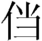
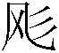

# 第一回 宴桃园豪杰三结义 斩黄巾英雄首立功

词曰：

滚滚长江东逝水，浪花淘尽英雄。是非成败转头空：青山依旧在，几度夕阳红。 白发渔樵江渚上，惯看秋月春风。一壶浊酒喜相逢：古今多少事，都付笑谈中。

话说天下大势，分久必合，合久必分：周末七国分争，并入于秦；及秦灭之后，楚、汉分争，又并入于汉；汉朝自高祖斩白蛇而起义，一统天下，后来光武中兴，传至献帝，遂分为三国。推其致乱之由，殆始于桓、灵二帝。桓帝禁锢善类[^1]，崇信宦官。及桓帝崩，灵帝即位，大将军窦武、太傅陈蕃共相辅佐，时有宦官曹节等弄权，窦武、陈蕃谋诛之，机事不密，反为所害，中涓[^2]自此愈横。

建宁二年四月望日，帝御[^3]温德殿。方升座，殿角狂风骤起，只见一条大青蛇，从梁上飞将下来，蟠于椅上。帝惊倒，左右急救入宫，百官俱奔避。须臾，蛇不见了。忽然大雷大雨，加以冰雹，落到半夜方止，坏却房屋无数。建宁四年二月，洛阳地震，又海水泛溢，沿海居民，尽被大浪卷入海中。光和元年，雌鸡化雄。六月朔，黑气十馀丈，飞入温德殿中。秋七月，有虹现于玉堂，五原山岸，尽皆崩裂。种种不祥，非止一端。帝下诏问群臣以灾异之由，议郎蔡邕上疏，以为蜺[^4]堕鸡化，乃妇寺干政[^5]之所致，言颇切直。帝览奏叹息，因起更衣。曹节在后窃视，悉宣告左右，遂以他事陷邕于罪，放归田里。后张让、赵忠、封谞、段珪、曹节、侯览、蹇硕、程旷、夏恽、郭胜十人朋比为奸，号为"十常侍"。帝尊信张让，呼为"阿父"。朝政日非，以致天下人心思乱，盗贼蜂起。

时巨鹿郡有兄弟三人：一名张角，一名张宝，一名张梁。那张角本是个不第秀才，因入山采药，遇一老人，碧眼童颜，手执藜杖，唤角至一洞中，以天书三卷授之，曰："此名《太平要术》。汝得之，当代天宣化，普救世人。若萌异心，必获恶报。"角拜问姓名。老人曰："吾乃南华老仙也。"言讫，化阵清风而去。角得此书，晓夜攻习，能呼风唤雨，号为"太平道人"。中平元年正月内，疫气流行，张角散施符水，为人治病，自称"大贤良师"。角有徒弟五百馀人，云游四方，皆能书符念咒。次后徒众日多，角乃立三十六方，大方万馀人，小方六七千，各立渠帅[^6]，称为将军，讹言："苍天已死，黄天当立；岁在甲子，天下大吉。"令人各以白土书"甲子"二字于家中大门上。青、幽、徐、冀、荆、扬、兖、豫八州之人，家家侍奉大贤良师张角名字。角遣其党马元义，暗赍[^7]金帛，结交中涓封谞，以为内应。角与二弟商议曰："至难得者，民心也。今民心已顺，若不乘势取天下，诚为可惜。"遂一面私造黄旗约期举事，一面使弟子唐周驰书报封谞。唐周乃径赴省中[^8]告变。帝召大将军何进调兵擒马元义斩之，次收封谞等一干人下狱。张角闻知事露，星夜举兵，自称"天公将军"，张宝称"地公将军"，张梁称"人公将军"，申言于众曰："今汉运将终，大圣人出。汝等皆宜顺天从正，以乐太平。"四方百姓，裹黄巾从张角反者四五十万。贼势浩大，官军望风而靡[^9]。何进奏帝火速降诏，令各处备御，讨贼立功，一面遣中郎将卢植、皇甫嵩、朱各引精兵，分三路讨之。

且说张角一军，前犯幽州界分。幽州太守刘焉，乃江夏竟陵人氏，汉鲁恭王之后也，当时闻得贼兵将至，召校尉邹靖计议。靖曰："贼兵众，我兵寡，明公宜作速招军应敌。"刘焉然其说[^10]，随即出榜招募义兵。榜文行到涿县，引出涿县中一个英雄。那人不甚好读书，性宽和，寡言语，喜怒不形于色，素有大志，专好结交天下豪杰，生得身长七尺五寸[^11]，两耳垂肩，双手过膝，目能自顾其耳，面如冠玉，唇若涂脂，中山靖王刘胜之后，汉景帝阁下玄孙，姓刘名备，字玄德。昔刘胜之子刘贞，汉武时封涿鹿亭侯，后坐酎金失侯[^12]，因此遗这一枝在涿县。玄德祖刘雄，父刘弘。弘曾举孝廉[^13]，亦尝作吏，早丧。玄德幼孤，事母至孝，家贫，贩屦[^14]织席为业。家住本县楼桑村。其家之东南，有一大桑树，高五丈馀，遥望之童童如车盖[^15]。相者云："此家必出贵人。"玄德幼时，与乡中小儿戏于树下，曰："我为天子，当乘此车盖。"叔父刘元起奇其言，曰："此儿非常人也！"因见玄德家贫，常资给之。年十五岁，母使游学，尝师事郑玄、卢植，与公孙瓒等为友。及刘焉发榜招军时，玄德年已二十八岁矣。

当日见了榜文，慨然长叹。随后一人厉声言曰："大丈夫不与国家出力，何故长叹？"玄德回视其人，身长八尺，豹头环眼，燕颔虎须，声若巨雷，势如奔马。玄德见他形貌异常，问其姓名。其人曰："某姓张，名飞，字翼德。世居涿郡，颇有庄田，卖酒屠猪，专好结交天下豪杰。恰才见公看榜而叹，故此相问。"玄德曰："我本汉室宗亲，姓刘，名备。今闻黄巾倡乱，有志欲破贼安民，恨力不能，故长叹耳。"飞曰："吾颇有资财，当招募乡勇，与公同举大事，如何？"玄德甚喜，遂与同入村店中饮酒。正饮间，见一大汉，推着一辆车子，到店门首歇了，入店坐下，便唤酒保："快斟酒来吃，我待赶入城去投军。"玄德看其人身长九尺，髯长二尺，面如重枣，唇若涂脂，丹凤眼，卧蚕眉，相貌堂堂，威风凛凛。玄德就邀他同坐，叩其姓名。其人曰："吾姓关，名羽，字长生，后改云长，河东解良人也。因本处势豪倚势凌人，被吾杀了，逃难江湖，五六年矣。今闻此处招军破贼，特来应募。"玄德遂以己志告之，云长大喜，同到张飞庄上共议大事。

飞曰："吾庄后有一桃园，花开正盛，明日当于园中祭告天地，我三人结为兄弟，协力同心，然后可图大事。"玄德、云长齐声应曰："如此甚好。"次日，于桃园中，备下乌牛白马祭礼等项，三人焚香再拜而说誓曰："念刘备、关羽、张飞，虽然异姓，既结为兄弟，则同心协力，救困扶危，上报国家，下安黎庶[^16]，不求同年同月同日生，只愿同年同月同日死。皇天后土，实鉴此心。背义忘恩，天人共戮！"誓毕，拜玄德为兄，关羽次之，张飞为弟。祭罢天地，复宰牛设酒，聚乡中勇士，得三百馀人，就桃园中痛饮一醉。来日收拾军器，但恨无马匹可乘。正思虑间，人报有两个客人，引一伙伴，赶一群马，投庄上来。玄德曰："此天佑我也！"三人出庄迎接。原来二客乃中山大商，一名张世平，一名苏双，每年往北贩马，近因寇发而回。玄德请二人到庄，置酒管待，诉说欲讨贼安民之意。二客大喜，愿将良马五十匹相送，又赠金银五百两，镔铁一千斤，以资器用。玄德谢别二客，便命良匠打造双股剑。云长造青龙偃月刀，又名"冷艳锯"，重八十二斤。张飞造丈八点钢矛。各置全身铠甲。共聚乡勇五百馀人，来见邹靖。邹靖引见太守刘焉。三人参见毕，各通姓名。玄德说起宗派，刘焉大喜，遂认玄德为侄。

不数日，人报黄巾贼将程远志统兵五万来犯涿郡。刘焉令邹靖引玄德等三人，统兵五百，前去破敌。玄德等欣然领军前进，直至大兴山下，与贼相见。贼众皆披发，以黄巾抹额[^17]。当下两军相对，玄德出马，左有云长，右有翼德，扬鞭大骂："反国逆贼，何不早降！"程远志大怒，遣副将邓茂出战。张飞挺丈八蛇矛直出，手起处，刺中邓茂心窝，翻身落马。程远志见折了邓茂，拍马舞刀，直取张飞。云长舞动大刀，纵马飞迎。程远志见了，早吃一惊，措手不及，被云长刀起处，挥为两段。后人有诗赞二人曰：

英雄露颖在今朝，一试矛兮一试刀。初出便将威力展，三分好把姓名标。

众贼见程远志被斩，皆倒戈而走。玄德挥军追赶，投降者不计其数，大胜而回。刘焉亲自迎接，赏劳军士。次日，接得青州太守龚景牒文，言黄巾贼围城将陷，乞赐救援。刘焉与玄德商议。玄德曰："备愿往救之。"刘焉令邹靖将兵五千，同玄德、关、张，投青州来。贼众见救军至，分兵混战。玄德兵寡不胜，退三十里下寨。玄德谓关、张曰："贼众我寡，必出奇兵，方可取胜。"乃分关公引一千军伏山左，张飞引一千军伏山右，鸣金[^18]为号，齐出接应。次日，玄德与邹靖引军鼓噪而进。贼众迎战，玄德引军便退。贼众乘势追赶，方过山岭，玄德军中一齐鸣金，左右两军齐出，玄德麾[^19]军回身复杀。三路夹攻，贼众大溃。直赶至青州城下，太守龚景亦率民兵出城助战。贼势大败，剿戮极多，遂解青州之围。后人有诗赞玄德曰：

运筹决算有神功，二虎还须逊一龙。初出便能垂伟绩，自应分鼎在孤穷。

龚景犒军毕，邹靖欲回。玄德曰："近闻中郎将卢植与贼首张角战于广宗，备昔曾师事卢植，欲往助之。"于是邹靖引军自回，玄德与关、张引本部五百人投广宗来。至卢植军中，入帐施礼，具道来意。卢植大喜，留在帐前听调。

时张角贼众十五万，植兵五万，相拒于广宗，未见胜负。植谓玄德曰："我今围贼在此，贼弟张梁、张宝在颍川，与皇甫嵩、朱对垒。汝可引本部人马，我更助汝一千官军，前去颍川打探消息，约期剿捕。"玄德领命，引军星夜投颍川来。时皇甫嵩、朱领军拒贼，贼战不利，退入长社，依草结营。嵩与计曰："贼依草结营，当用火攻之。"遂令军士，每人束草一把，暗地埋伏。其夜大风忽起。二更以后，一齐纵火，嵩与各引兵攻击贼寨，火焰张天，贼众惊慌，马不及鞍，人不及甲，四散奔走。

杀到天明，张梁、张宝引败残军士，夺路而走。忽见一彪[^20]军马，尽打红旗，当头来到，截住去路。为首闪出一将，身长七尺，细眼长髯，官拜骑都尉，沛国谯郡人也，姓曹名操，字孟德。操父曹嵩，本姓夏侯氏，因为中常侍曹腾之养子，故冒姓曹。曹嵩生操，小字[^21]阿瞒，一名吉利。操幼时，好游猎，喜歌舞，有权谋，多机变。操有叔父，见操游荡无度，尝怒之，言于曹嵩，嵩责操。操忽心生一计：见叔父来，诈倒于地，作中风之状。叔父惊告嵩，嵩急视之，操故无恙。嵩曰："叔言汝中风，今已愈乎？"操曰："儿自来无此病，因失爱于叔父，故见罔[^22]耳。"嵩信其言。后叔父但言操过，嵩并不听。因此，操得恣意放荡。时人有桥玄者谓操曰："天下将乱，非命世[^23]之才不能济。能安之者，其在君乎？"南阳何颙见操言："汉室将亡，安天下者，必此人也。"汝南许劭，有知人之名。操往见之，问曰："我何如人？"劭不答。又问，劭曰："子治世之能臣，乱世之奸雄也。"操闻言大喜。年二十，举孝廉，为郎[^24]，除洛阳北部尉[^25]。初到任，即设五色棒十馀条于县之四门，有犯禁者，不避豪贵，皆责之。中常侍蹇硕之叔，提刀夜行，操巡夜拿住，就棒责之。由是，内外莫敢犯者，威名颇震。后为顿丘令。因黄巾起，拜为骑都尉，引马步军五千，前来颍川助战。正值张梁、张宝败走，曹操拦住，大杀一阵，斩首万馀级，夺得旗旛、金鼓、马匹极多。张梁、张宝死战得脱。操见过皇甫嵩、朱儁，随即引兵追袭张梁、张宝去了。

却说玄德引关、张来颍川，听得喊杀之声，又望见火光烛天，急引兵来时，贼已败散。玄德见皇甫嵩、朱儁，具道卢植之意。嵩曰："张梁、张宝势穷力乏，必投广宗去依张角。玄德可即星夜往助。"玄德领命，遂引兵复回。到得半路，只见一簇军马，护送一辆槛车[^26]，车中之囚，乃卢植也。玄德大惊，滚鞍下马，问其缘故。植曰："我围张角，将次[^27]可破，因角用妖术，未能即胜。朝廷差黄门[^28]左丰前来体探，问我索取贿赂。我答曰：'军粮尚缺，安有馀钱奉承天使[^29]？'左丰挟恨，回奏朝廷，说我高垒[^30]不战，惰慢军心。因此朝廷震怒，遣中郎将董卓来代将我兵，取我回京问罪。"张飞听罢，大怒，要斩护送军人，以救卢植。玄德急止之曰："朝廷自有公论，汝岂可造次[^31]？"军士簇拥卢植去了。

关公曰："卢中郎已被逮，别人领兵，我等去无所依，不如且回涿郡。"玄德从其言，遂引军北行。行无二日，忽闻山后喊声大震。玄德引关、张纵马上高冈望之，见汉军大败，后面漫山塞野黄巾盖地而来，旗上大书"天公将军"。玄德曰："此张角也！可速战！"三人飞马引军而出。张角正杀败董卓，乘势赶来，忽遇三人冲杀，角军大乱，败走五十馀里。三人救了董卓回寨。卓问三人现居何职，玄德曰："白身[^32]。"卓甚轻之，不为礼。玄德出，张飞大怒曰："我等亲赴血战，救了这厮[^33]，他却如此无礼！若不杀之，难消我气！"便要提刀入帐来杀董卓。正是：人情势利古犹今，谁识英雄是白身？安得快人如翼德，尽诛世上负心人！毕竟董卓性命如何，且听下文分解。

[^1]:禁锢（ɡù）善类------指东汉桓帝刘志时的"党锢之祸"。其时宦官集团把持政权，引起士族官僚集团的反对，形成激烈的争斗。结果宦官集团得势，把士族集团中的大批反对派，镇压迫害，逮捕定罪。后虽释放，却终身不准做官，叫做"禁锢"。善类，意即好人，指反对宦官专权的士大夫。

[^2]:中涓------皇帝宫廷中，管理通报、打扫清洁的臣子。此指宦官，也即太监。

[^3]:御------帝王的特定用语，皇帝衣食住行的行动都叫御。御某殿，即登某殿。

[^4]:蜺------同霓。古代迷信观念，认为色彩鲜明的内环叫虹，雄性；色彩暗淡的外环叫蜺，雌性。

[^5]:妇寺干政------妇指皇太后、皇后、皇帝的乳母一类人；寺是寺人（侍人），即宦官。干政，干预政事，掌握实权。

[^6]: 渠帅------首领。

[^7]: 赍（jī）------持，携带。

[^8]:省中------皇帝的居处叫禁中，政府长官办公的地方叫省中，合称禁省，也用以泛指宫禁。后文第二回有"省家"，义略同，侧重在指政府长官。

[^9]: 靡（mǐ）------溃散。

[^10]:然其说------以他的意见为是，赞同他的意见。然，动词，以为正确。后文又有"然之"的句法，义同。

[^11]:生得身长七尺五寸------下文又有"身长九尺"等文。古代的尺度比现在为小（汉尺约相当今尺七八寸），所以古代人的身高和现代人实际并无大异。

[^12]:坐酎（zhòu）金失侯------坐，这里作犯法解。汉代法制，皇帝祭祀宗庙时诸侯要献金助祭，叫做酎金。坐酎金失侯，是说犯了没有按照规定缴纳酎金的法制，被削去侯爵。

[^13]:举孝廉------汉代选拔士人做官的一种制度：地方官向朝廷推荐孝父母而清廉的人，叫做举孝廉。被推荐的人得到这种做官的资格，也叫举孝廉。

[^14]: 屦（jù）------麻鞋。

[^15]:童童如车盖------形容大树枝叶非常茂密。古代统治者车上设有遮幔，形略如伞，叫做车盖。封建迷信意识，认为树生得像车盖，就是这家要出"贵人"的"预兆"。

[^16]: 黎庶------老百姓。

[^17]:以黄巾抹额------用黄色巾帕裹扎额部，是武人的一种打扮（抹额，也常作名词用）。

[^18]:鸣金------敲击钲、铙（后来则多指锣）等金属乐器。一般是军中收兵的号令；这里反用为进军的信号。

[^19]: 麾（huī）------指挥。

[^20]:一彪------也作一。一军马，即一枝人马，但有时偏重在形容它出现的突然，来势的迅猛。

[^21]: 小字------小名，乳名。

[^22]: 见罔------被诬枉。

[^23]:命世------义同"名世"，即名声显赫于当世的意思。

[^24]:郎------官名，一般是殿廷侍从之职。汉代有中郎、侍郎、郎中等官，统称为郎，往往作为初入仕途、转任其他重要官职的阶梯。

[^25]:除洛阳北部尉------除，授官任职。尉是县级的次官，主管地方治安；洛阳是大县，设两名尉，分管南部、北部。"北部尉"，原书误作"北都尉"，据《三国志·魏书·武帝纪》改。

[^26]: 槛车------有栅栏的囚车，用来押解罪犯。

[^27]: 将次------将要、快要达到某种地步。

[^28]:黄门------原是宫廷的禁门，一般用作宦官、太监的代称。东汉时多用阉人充黄门侍郎、小黄门、黄门令、中黄门等官，掌管侍从皇帝、传递文书、联系内外及跪拜赞礼等事，由于为皇帝所亲信，权势很大。

[^29]: 天使------指称皇帝派遣的使臣。

[^30]:高垒------古代军事用语，用土筑成很高的防御工事，是守而不战的措施。

[^31]: 造次------急促、匆忙的意思，这里作冒失解。

[^32]: 白身------平民，没有官职或功名的人。

[^33]:厮------封建统治阶级把从事打柴、牧马等劳役的奴隶叫作厮，是一种侮辱性的称呼。这里是骂人的话。
